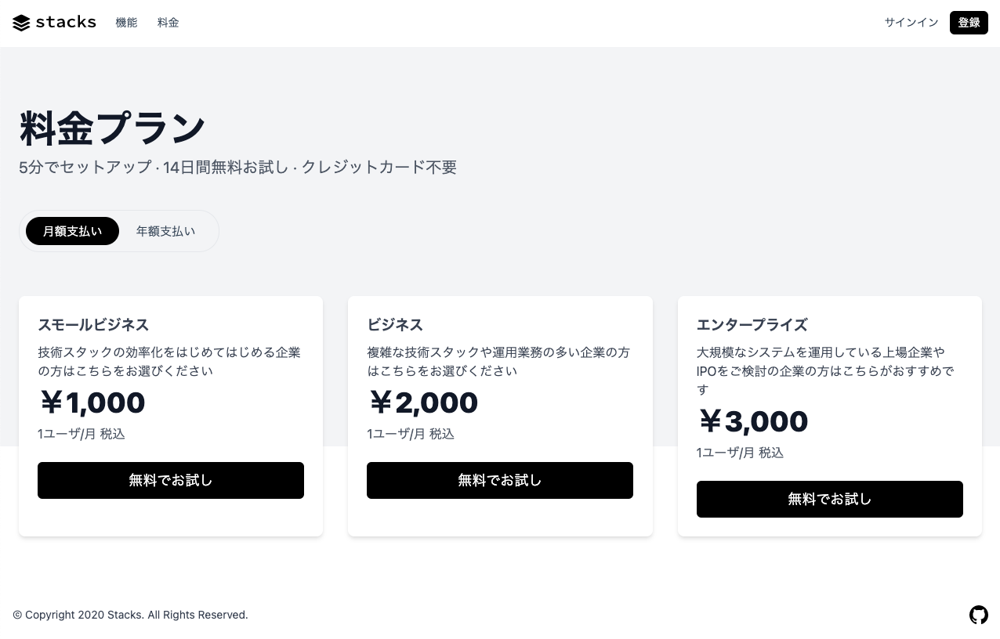

# Next.js サブスクリプションサービス・スターター

高性能なSaaSアプリケーションのためのオールインワンのスターターキットです。Next.jsの開発者は、数回クリックするだけで、独自のSaaSサブスクリプションアプリケーションをクローンし、デプロイすることができます。完全にカスタマイズすることができます。

vercelが提供している下記のスターターをベースにしています。

https://github.com/vercel/nextjs-subscription-payments

## 特徴

- [Supabase](https://supabase.io/docs/guides/auth)で安全なユーザー管理と認証を実現します。
- [Supabase](https://supabase.io/docs/guides/database)を使って、PostgreSQL上で強力なデータアクセス＆管理ツールを提供します。
- [Stripe Checkout](https://stripe.com/docs/payments/checkout)との統合、[Stripe customer portal](https://stripe.com/docs/billing/subscriptions/customer-portal)との統合、全ての配管が既に設定されています。
- [Stripe webhooks](https://stripe.com/docs/webhooks)を介して、料金プラン、およびサブスクリプションのステータスを自動的に同期します。

ベースにしているスターターの特徴に加えて、本スターターでは、

- 完全日本語化
- Typescriptによる記述なので、IDEの強力な補完の恩恵が受けられます。
- [Kutty](https://github.com/praveenjuge/kutty/)を使用しているので、コンポーネントを柔軟に拡張することができます。

## デモ

- https://nextjs-subscription-payments.stackhacker.vercel.app/

[](https://nextjs-subscription-payments.stackhacker.vercel.app/)

## アーキテクチャ


## Vercelにデプロイ

Vercelにデプロイする際に、Supabaseのアカウントとプロジェクトの作成、Stripeのテストアカウントの作成が案内され、StripeのWebhookエンドポイントを自動的に作成します。Supabase と Stripe インテグレーションのインストール後、関連するすべての環境変数が設定されるため、デプロイ後すぐにプロジェクトを使用することができます🚀。

[](https://vercel.com/new/git/external?repository-url=https%3A%2F%2Fgithub.com%2Fstackhackerio%2Fnextjs-subscription-payments&project-name=nextjs-subscription-payments&repo-name=nextjs-subscription-payments&demo-title=Next.js%20Subscription%20Payments%20Starter&demo-description=Demo%20project%20on%20Vercel&demo-url=https%3A%2F%2Fsubscription-payments.vercel.app&demo-image=https%3A%2F%2Fsubscription-payments.vercel.app%2Fdemo.png&integration-ids=oac_pb1dqJT8Ry2D99Q0o9qXWIhJ,oac_jUduyjQgOyzev1fjrW83NYOv&external-id=nextjs-subscription-payments)

[](https://vercel.com/new/git/external?repository-url=https%3A%2F%2Fgithub.com%2Fstackhackerio%2Fnextjs-subscription-payments&project-name=nextjs-subscription-payments&repo-name=nextjs-subscription-payments&demo-title=Next.js%20Subscription%20Payments%20Starter&demo-description=Demo%20project%20on%20Vercel&demo-url=https%3A%2F%2Fsubscription-payments.vercel.app&demo-image=https%3A%2F%2Fsubscription-payments.vercel.app%2Fdemo.png&integration-ids=oac_pb1dqJT8Ry2D99Q0o9qXWIhJ,oac_jUduyjQgOyzev1fjrW83NYOv&external-id=nextjs-subscription-payments)

プロジェクトがデプロイできたら、次の設定手順を進めてください。

## Supabase Authの設定

#### メールアドレス認証の設定

ユーザが登録して、すぐサービスを使用できるようにしています。そのため、Supabaseのダッシュボードでメールアドレスの確認を無効にして下さい。

Authenticationの[Settings]から、[General]の[Disable email confirmation]をオンにします。

#### OAuthプロバイダの設定

GitHubの認証を追加するために、設定の概要を下記に示します。

まず、GitHubでOAuthアプリケーションを追加します。

- [Settings]ページから[Developer settings]を開きます
- [New OAuth App]でアプリケーション追加の入力画面を開きます

項目に下記の内容を入力します。

- Appliction name: アプリケーションの名称
- Homepage URL: ホームページURL（ない場合は、`http://localhost`などURLとして有効な値を入力します）
- Application description: アプリケーションの概要
- Authorization callback URL: 認証用のコールバックURL

認証用のコールバックURLは、Supabaseのダッシュボードより、[Settings]の[API]を開いて、[Config]の[URL]を参照して、`/auth/v1/callback`を追加します。下記の様な記述にあります。

https://xxxxxxxxxxxxxxx.supabase.co/auth/v1/callback

アプリケーションの追加が完了すると、[Client ID]と[Client secrets]が発行されます。

次に、Supabaseのダッシュボードより、[Authentication]から[Settings]を開いて、[GitHub enabled]をオンにします。先ほどの、[Client ID]と[Client secret]をそれぞれ入力して保存します。

詳細は、Supabaseの[ドキュメント](https://supabase.io/docs/guides/auth#third-party-logins)を参照して下さい。

## Stripeの設定

### 製品・価格情報の作成

Stripeが顧客のユーザーに定期的な支払いを自動的に請求するためには、[Stripeダッシュボード](https://dashboard.stripe.com/test/products)で商品・価格情報を作成する必要があります。商品・価格情報を作成・更新すると、変更内容はSupabaseのデータベースと自動的に同期します。

Stripe Checkoutは現在、特定の間隔であらかじめ定義された金額を請求する価格プランをサポートしています。より複雑なプラン（例：異なる価格帯やシート）はまだサポートされていません。

例えば、異なる価格帯のビジネスモデルを作成することができます。

- 商品1: ホビー
  - 価格1: 1,000円/月
  - 価格2: 10,000円/年
- 商品2: フリーランス
  - 価格1: 2,000円/月
  - 価格2: 20,000円/年

後述の[ローカルでの開発]をしていただくと、コマンドでサンプル価格を登録することもできます。

### Stripeカスタマーポータルの設定

1. [設定](https://dashboard.stripe.com/settings/branding)でブランディングを設定します。
1. カスタマーポータルの設定 [settings](https://dashboard.stripe.com/test/settings/billing/portal)。
1. 「顧客による支払い方法の更新を許可」をオン
1. 「顧客による低支払いのキャンセルを許可」をオン
1. 「顧客による別の料金プランへの変更を許可」をオン
1. 「商品」欄で変更を許可する製品と価格を追加
1. 必要なビジネス情報とリンクを設定

以上で、顧客から定期収入を得る準備が整いました😄

## 本番稼動

本番稼働の前に、テストモードのStripe製品をすべてアーカイブしておきます。そうすることで、テストモードとライブモードの製品が混在しないようになります。ライブモードの商品を作成する前に、以下の手順でライブモードの env vars と webhooks を設定してください。

プロジェクトをライブモードで実行し、Stripeで実際の支払いを処理するには、[Stripe Go Live](https://vercel.com/integrations/stripe-live)インテグレーションをプロジェクトに追加します。これにより、本番環境の環境変数としてライブ API キーと webhook のシークレットが設定されます。

その後、変更を有効にするために、本番環境のデプロイメントを再構築する必要があります。vercelのプロジェクトのダッシュボードで、[Deployments]のタブに移動し、最新の[Deployments]を選択して、メニューボタン（[Visit]ボタンの隣）をクリックし、[Redeploy]を選択します。

## ローカルでの開発

Vercel でデプロイすると、ローカルマシンにクローンできるリポジトリが作成されます。

次に、[Vercel CLI](https://vercel.com/download)を使ってプロジェクトをリンクします。

```bash
vercel login
vercel link
```

### ローカルでの env vars の設定

Vercel CLIを使って、開発用のenv varsをダウンロードします。

```bash
vercel env pull .env.local
```

これにより、プロジェクトフォルダ内に新しい `.env.local` ファイルが作成されます。セキュリティ上の理由から、[Supabaseダッシュボード](https://app.supabase.io/) (Settings > API)から `SUPABASE_SERVICE_ROLE_KEY` を手動で設定する必要があります。最後に、ウェブフックのシークレットは、ローカルでのテスト時とVercelにデプロイした場合で異なります。以下の手順で対応するWebhookシークレットを取得してください。

### Stripe CLIを使ってwebhookをテストする

まず[CLIのインストール](https://stripe.com/docs/stripe-cli)と[Stripeアカウントのリンク](https://stripe.com/docs/stripe-cli#login-account)を行います。

次に webhook の転送を開始します。

```bash
stripe listen --forward-to=localhost:3000/api/webhooks
```

CLIでは、webhookのシークレット（例えば、`whsec_***`）をコンソールに表示します。.env.local` ファイルで `STRIPE_WEBHOOK_SECRET` をこの値に設定してください。

### 依存関係のインストールとNext.jsクライアントの実行

```bash
npm install
npm run dev
```

### サンプルの価格登録

下記のコマンドでサンプルの価格を登録することもできます。

```
stripe fixtures fixtures/stripe.json
```
